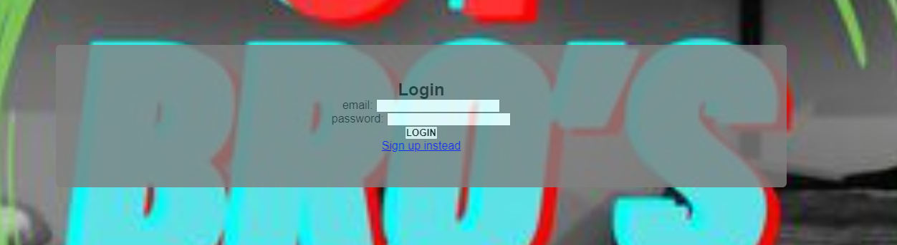
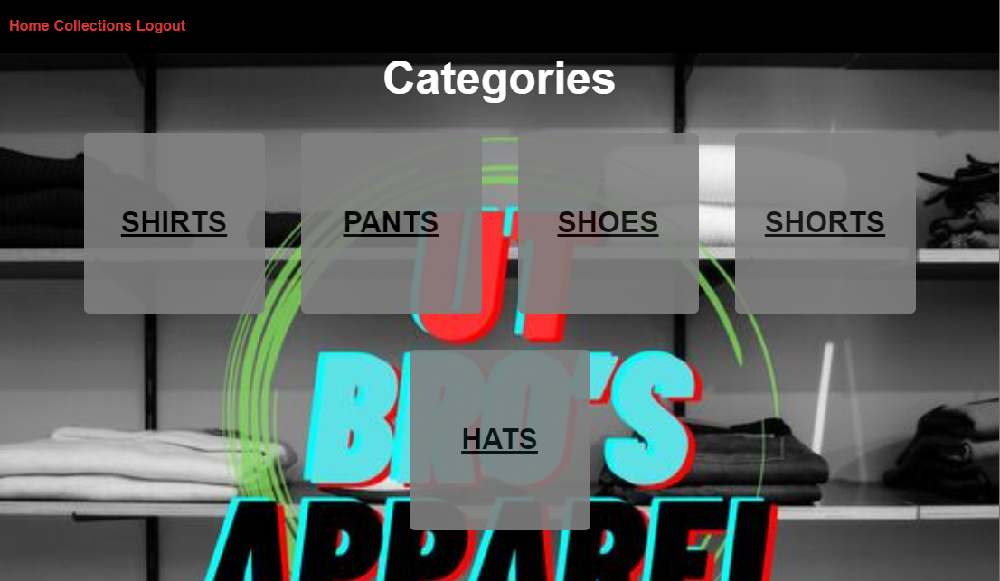
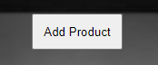
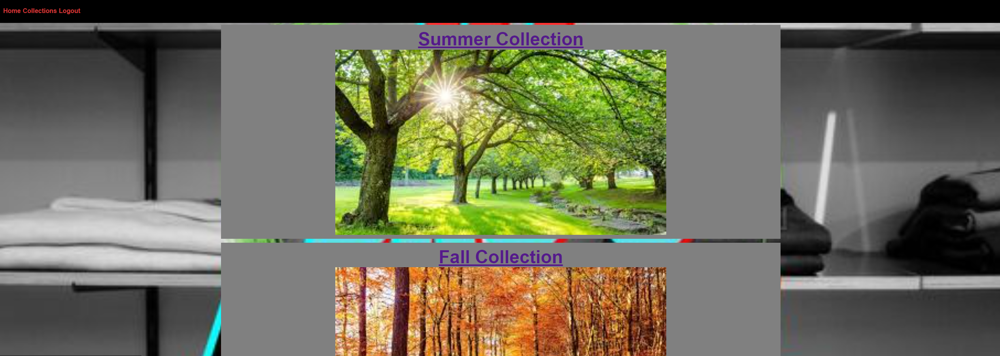

[Description](#description) | [Installation](#installation) | [Links](#links) | [Screenshots](#screenshots) | [Contributors](#contributors) | [Sources](#sources)

# UT Bro's Apparel 🧢

## Description

For this assignment my group and I were tasked with creating a real-world full-stack application to showcase to potential employers. We used both Node and Express back end had GET and POST routes for adding new data, our application is structured around the MVC paradigm, uses a Handlebars.js engine and also uses the Multer npm package to handle uploading files. Our application is an inventory management system for a clothing company where we are able to add, delete, and update new and existing inventory, the inventory is grouped together by seasonal categories for your convenience.

## Installation

- Step 1: The user will need to have [Node.js](https://nodejs.org/en/download) installed on their PC or use the link provided to install it.
- Step 2: Before running the program the user will need to install the packages by typing 'npm install' into the terminal integrated to the location of the folder holding the program.
- Step 3: The user will need to have a Heroku installed on their PC, this can be achieved by typing 'npm install -g heroku' into their terminal.
- Step 4: [Heroku](https://id.heroku.com/login) will need to be linked to your [GitHub](https://github.com/) account. This can be accomplished after creating the app than under deployment method select GitHub.

## Links

[Heroku: UT Bro's Apparel](https://ut-bros-apparel-0bcd7da3cb4b.herokuapp.com/login)

All repo links are listed within the links under the [contributors](#contributors) section below.

## Screenshots

Log-in: This is where you will enter your login credentials (for this assignment you can use one from the userData.json within the seeds folder).

Once you log-in you will be brought to this page of categories where you can find what clothing item you are looking to purchase, update, or add.

At the top of each category page you will see this 'Add Product' button where you will be able to add you desired item(s).

The collections tab will take you to this page of 'seasonal' collections where you can shop for your season of choice!

## Contributors

[Code Rademacher](https://github.com/cprademacher/project2) | [Jake Howdeshell](https://github.com/cprademacher/project2) | [Santiago Garcia-Chavez](https://github.com/cprademacher/project2) | [John Benson](https://github.com/cprademacher/project2) | [Brandon Williams](https://github.com/cprademacher/project2)

## Sources

All images used were found at https://unsplash.com/
